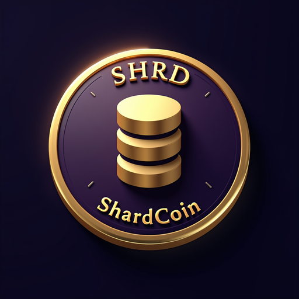

# ShardWallet App

<p align="center">
  
</p>

Cross-platform non-custodial wallet for [ShardCoin](https://github.com/code2031/ShardCoin) (SHRD), built with Flutter.

## Features

- **Non-custodial** — BIP39 seed phrase, BIP32 HD keys, stored on-device only
- **Cross-platform** — Android, iOS, Linux, macOS, Windows, Web
- **Monero-style UI** — sidebar navigation on desktop, bottom tabs on mobile
- **Send** — fee selector (Low/Normal/High), Send Max, address book
- **Receive** — QR code generation, address copy, new address derivation
- **Transaction history** — detail dialog, CSV export
- **Network stats** — block height, difficulty, chain info
- **Seed backup** — view seed phrase and derived addresses
- **Dark theme** — purple accent, IBM Plex Sans typography

## Quick Start

### Prerequisites

- [Flutter SDK](https://flutter.dev/docs/get-started/install) 3.10+
- A running ShardCoin node (`shardcoind`)

### Build & Run

```bash
flutter pub get
flutter run
```

### Build for Production

```bash
# Web
flutter build web --release

# Android
flutter build apk --release

# Linux
flutter build linux --release

# iOS (requires macOS + Xcode)
flutter build ios --release
```

### Linux Build Dependencies

```bash
sudo apt install libgtk-3-dev libsecret-1-dev libjsoncpp-dev lld clang cmake ninja-build pkg-config
```

## Connecting to a Node

On first launch, configure your ShardCoin node connection:

| Setting | Default |
|---------|---------|
| RPC URL | `http://127.0.0.1:7332` |
| Username | (your rpcuser) |
| Password | (your rpcpassword) |
| Wallet | (optional) |

For regtest testing:
```bash
shardcoind -regtest -daemon -rpcuser=shardcoin -rpcpassword=shardcoin123
shardcoin-cli -regtest createwallet main
shardcoin-cli -regtest -generate 101
```

Then connect to `http://127.0.0.1:17443` with user `shardcoin` / pass `shardcoin123`.

## Network Parameters

| Parameter | Value |
|-----------|-------|
| Coin | ShardCoin (SHRD) |
| BIP44 Coin Type | 1000 |
| Derivation Path | m/84'/1000'/0'/0/* |
| Bech32 Prefix | `shrd` |
| Mainnet RPC | 7332 |
| Testnet RPC | 17332 |
| Regtest RPC | 17443 |

## Security

- Seed phrase encrypted on-device via platform secure storage (Keychain/Keystore/libsecret)
- Private keys never sent to the node
- Node used only for blockchain data and broadcasting signed transactions
- No analytics, no telemetry, no external network calls except to your configured node

## Related Projects

- [ShardCoin](https://github.com/code2031/ShardCoin) — Full node, miner, and protocol
- [ShardWallet](https://github.com/code2031/ShardWallet) — PWA web wallet

## License

MIT
